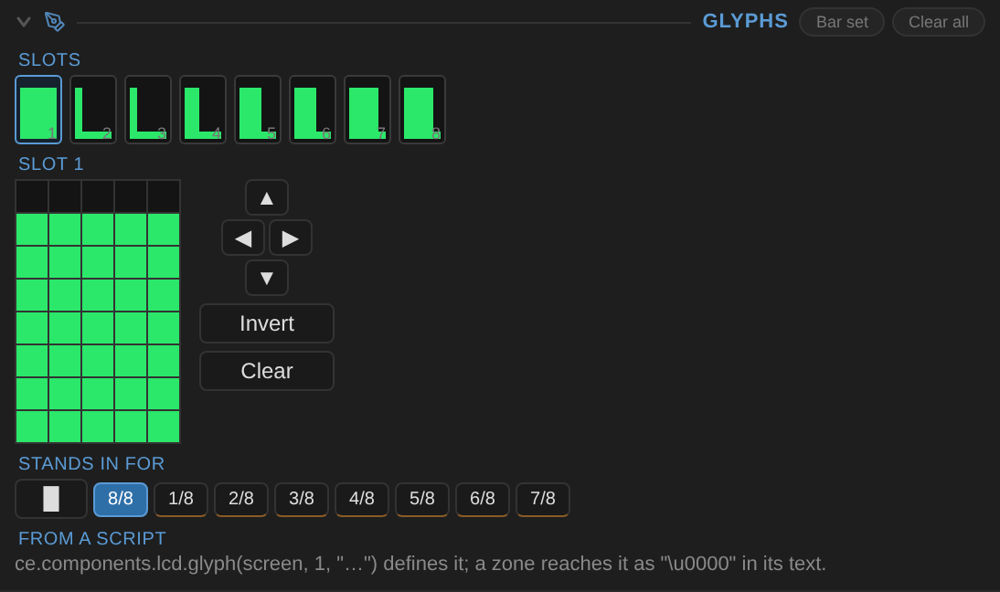
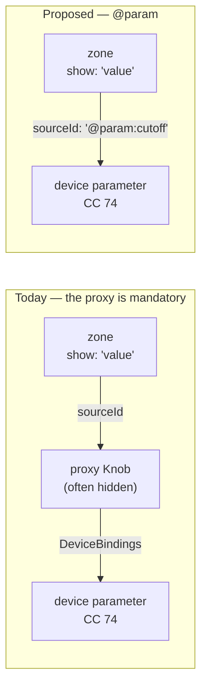
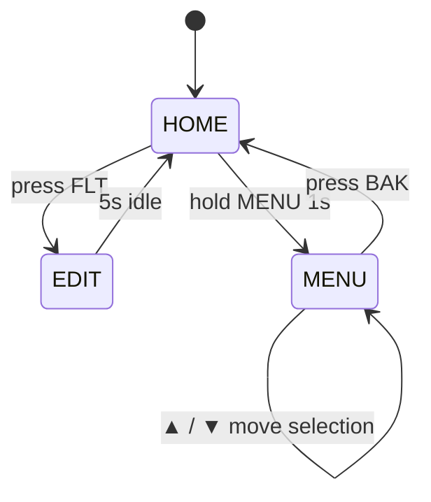
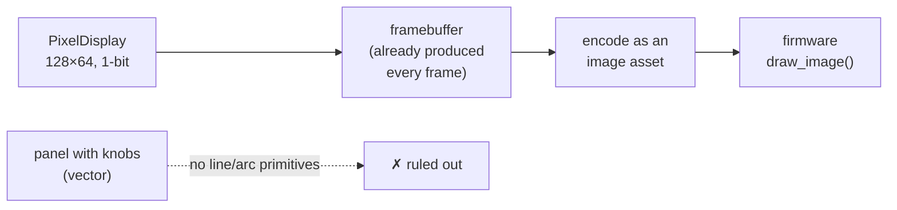

# Display components: what is missing, and what it would take

A design record for `LcdDisplay` and `PixelDisplay`, written after an audit of what the two
components actually do. Nine proposals, in three tiers: things that are simply absent, things that
change what the component *is*, and three that are speculative on purpose.

**Where it ended up: six built, one answered, two still speculative.** The note has been kept as a
record rather than rewritten into a description, so each proposal now carries what shipped
underneath what was proposed — including the three places the plan was wrong, which are the parts
worth a reader's time:

| Proposal | The plan | What building it found |
| --- | --- | --- |
| 2 | Address pixel elements by index, then by `id` | Neither works. The index is the paint order the inspector rewrites; the id is an `el_…` the UI never shows. Elements needed a **name**. |
| 4 | Decide whether a display gains a real interaction model | It should not. Pressable zones are an **exception on the existing click path**, and a display with a `Mouse` section would be a control that merely looks like one. |
| 7 | A one-day hardware spike on CTRL49 bandwidth | No spike needed, and bandwidth was the wrong question. The answer was in `CE/src/ControlSurface/`, already built. |

**This note partly argues with [screen-builder-design.md](screen-builder-design.md).** That document
rules out compiling CEditor panels to the CTRL49's screen, for good reasons. Proposal 7 does not
overturn that — and having been answered, it now hands that document a smaller idea rather than
taking one from it. Read the non-goals there before reading 7 here.

---

## How to read the pictures

Two kinds, and they must not be confused:

- **`docs/media/display-*.gif`** are *recordings*. They are the real renderers driven by real
  controls; nothing in them is a feature the components lack. See [the gallery](../display-gallery.md).
- **`docs/media/mockup-*.png`** illustrate *this document*, rendered by the same machinery
  (`gen-display-demos.mjs --mockups`, scenes in `displayDemos/mockups.mjs`). **Most of them are now
  recordings of shipped features rather than pictures of proposals**, because two of the three
  proposals they illustrate have since been built:

  | Figure | What it is now |
  | --- | --- |
  | `mockup-softkeys-*` | Shipped. Real `press` actions; the pressed one captured mid-press, with the inverse video drawn by the renderer. |
  | `mockup-glyphs-*` | Shipped. The same character LCD twice, differing only in eight glyph definitions. The "after" used to be a `PixelDisplay` impersonating a character LCD; that impersonation is gone. |
  | `mockup-glyph-editor` | Shipped, and the odd one out: it photographs the INSPECTOR rather than a screen. The thing that shipped there is a way of drawing, and input is the one subject a still is better at than a recording. |
  | `mockup-state-*` | Shipped. All three edges are real: a press in, a `timeoutMs` out, and a cursor that moves. MENU is now a working menu — `cursorMax`, a marker zone per row, and ▲/▼ keys that move the selection. |

The state screens are what made these mockups necessary in the first place, and they are also the
clearest case for why a still is not enough: the MENU figure looks much like the drawing it
replaced, because what changed is that pressing ▼ now moves the marker. Behaviour, not pixels —
which is the document's job rather than the picture's.

## The audit, in numbers

**This table is the state that produced the list, not the state today.** It was counted on
2026-09-12, before any of the proposals were built — so the CGRAM row now reads differently, the
`pixel.*` row's claim is the one proposal 2 went on to disprove, and both verb counts have grown
by what the proposals added. It is left as it was because it is
the evidence the proposals were argued from; the per-proposal sections say what has since changed.

| Fact | Value |
| --- | --- |
| `LcdDisplay` sections | `Background, Display, Effects, DeviceBindings, Scripts` |
| `PixelDisplay` sections | `Background, Pixel, Effects, DeviceBindings, Scripts` |
| Device-binding ports, both | `text`, `value`, `brightness`, `backlight` |
| `exportValues`, both | `[]` — neither is host-automatable |
| Zone `show` kinds | 16 |
| `lcd.*` script verbs | 35 |
| `pixel.*` script verbs | 19, **not one of which writes content** — *proposal 2 has since shipped eight that do* |
| Hits for CGRAM / custom characters | 0 — *proposal 1 has since shipped* |

The two verb counts are the whole flattened surface — the hand-written declarations, the
`showGlass`/`showGhost`/`showScanlines`/`showGrid` chrome appended to every family, and the
`read`/`size`/`fill` kinds each family gets for free. (An earlier draft of this note said 28 and 14,
which counted only the hand-written `v(...)` lines. The corrected figures do not change the
finding: the full `pixel` list is `backlight, brightness, contrast, gamma, glow, anim, animPreset,
animSpeed, animLoop, animFps, layoutTransition, transitionMs, brightnessSource, backlightSource,
showGlass, showGhost, showScanlines, showGrid, read` — every one of them chrome.)

Two of those rows are the whole of Tier 1. Neither component has a `Mouse`, `Behavior` or
`HitZones` section — that was the whole of proposal 4, and it is **still true after that proposal
shipped**: pressable zones were built as an exception on the existing click path rather than by
giving a display an interaction model of its own.

---

# Tier 1 — gaps, not decisions

These three are asymmetries. Nothing was decided against; they were not reached.

## 1. User-definable glyphs on the character LCD — **shipped**

**What was missing.** Zero hits for CGRAM, custom characters or user glyphs anywhere in the tree.
Every real HD44780 has eight programmable 5×8 characters, and `PixelDisplay` already has *two*
mechanisms for arbitrary artwork — `bitmap` elements with a `bits` string, and a `customFont`
sprite sheet. The character LCD has neither.

**Why it bites.** `resolveZoneContent`'s `bar` kind builds its bargraph from `█` plus the seven
partial-block characters `▏▎▍▌▋▊▉`. That is a clever fallback and it has two costs: the bar's
appearance depends on the *system font* carrying those glyphs, and no block character has a foot,
so a bar can never have the baseline that real panel bargraphs use to stay readable at a glance.

Both of these are now the **same renderer on the same panel type**, driven by the same linked knob
through the same `bar` zone. The only difference between them is eight glyph definitions:


The difference is not decoration. Each bar segment gains a foot and a gap, so the bar's length
reads without counting it; and `MIDI`/`PRG` stop spending eleven of twenty columns on words a
symbol says in one.

**What shipped.** Eight slots on the `Display` section, authored the way a datasheet writes them:

```js
Display: {
  glyphs: [
    { bits: '.....|.###.|.###.|.###.|.###.|.###.|.###.|#####', for: '█' },  // bar, full
    { bits: '.....|.....|.....|.....|.###.|.###.|.###.|#####', for: '▌' },  // bar, half
    { bits: '.###.|#...#|#.#.#|#...#|#####|..#..|..#..|.###.', for: '' },   // a MIDI plug
  ],
}
```

**Two ways to reach a glyph, because the hardware's way and the useful way differ.** *By slot:*
glyph n is the character with code n, `\x00`–`\x07`, in any zone's text — literally how CGRAM is
addressed. *By claim:* a glyph can name an ordinary character it stands in for. That last one is
what makes `bar` work without touching it: `resolveZoneContent` keeps composing block characters,
and a glyph claiming `█` turns them into a segmented bargraph at draw time. Teaching the pure zone
engine about glyphs would have pushed display state into it for no gain.

**`glyphs` defaults to eight blank slots, and that detail earns its keep twice.** It is what the
hardware is — an empty slot draws nothing and is not a glyph — and it is why `lcd.glyph(n, bits)`
could be an index-addressed `item` verb where the identical mechanism was a dead no-op on
`Pixel.elements` (proposal 2). The verb is marked `fixed`, like the Drum Pads' override array:
CGRAM is eight slots and an insert would mint a ninth that `\x00`–`\x07` cannot address.
`scriptComponents.test.js` caught that before it shipped.

### The inspector editor, which was the last piece

Until this the slots were reachable from a script and from hand-editing the saved panel, and from
nowhere else. The authoring form is forty characters of `#` and `.`; nobody draws a picture that
way, so the feature was real and unusable.



Eight slots with live previews, a 5×8 grid for the selected one, and nudge / invert / clear. The
previews are the same `glyphPath` the renderer draws from, so the strip shows what the screen will
show rather than a second implementation of the picture. The editing itself is pure —
`toggleGlyphBit`, `invertGlyphBits`, `shiftGlyphBits` in `lcdUserGlyphs.js`, bits in and bits out —
so the inspector holds no parallel copy and a test drives the same calls a click does.

Three things in that figure are decisions rather than layout:

- **One grid, not eight.** Eight 5×8 grids at a clickable size is 320 buttons and about 500px of a
  550px inspector. The preview strip does the job the eight grids would have — you can see all
  eight at once and pick one.
- **"Bar set" fills all eight in one press,** because that is the documented main use and asking
  somebody to hand-draw it was never a plan: eight glyphs at forty clicks each, each claiming a
  character they would first have to find somewhere to paste. The set is generated from the bar
  renderer's own `BAR_CHARS`, so the editor and `barString` cannot disagree about which characters
  a bargraph is made of. **Five columns cannot show eight widths** — two adjacent eighths land on
  the same number of lit pixels — and that is the cell being five pixels wide, not the generator
  being wrong. What the glyphs buy is the two things a font cannot: the baseline foot, and not
  depending on the font carrying `▏▎▍▌▋▊▉` at all.
- **The claim palette is labelled `8/8`, `1/8` … `7/8` rather than drawn as the characters
  themselves.** Whether the font has them is exactly what a glyph set stops mattering, so a picker
  that relies on it would be the one control in the feature that contradicts the feature. The
  character is in each button's tooltip, and the free-text box beside them still takes any
  character at all.

**Slot addressing stays script-only, and that is not an oversight.** A zone reaches glyph *n* as
the character `\x00`–`\x07`, which is how the hardware does it and which cannot be typed into a
text box. So the inspector's way in is the claim, and the script's way in is the slot; the editor
prints the slot's own address under the grid rather than pretending otherwise.

## 2. `PixelDisplay` cannot be scripted, only decorated — **shipped**

**What was missing.** Every one of the `pixel.*` verbs was chrome — see the full list in the audit
above. Not one wrote an element. The LCD at least had `lcd.text(row, line)` and `lcd.clear()`.

The richest display in the product — the one with `wave`, `adsr`, `scope` and free pixel placement
— was the one a script could not write a word to. Its `elements` array was editable only in the
inspector.

**This one was attempted, failed, and the failure is the useful part.** It is written up in full
because the record of *why* the obvious mechanism is wrong is worth more than the fix.

The obvious mechanism is the `item` verb kind — "one property of one element of an array field,
addressed 1-based" — exactly how `DrumPads` addresses a pad:

```js
v('text', 'elements', ITEM, { item: 'text', kind: STR }),   // pixel.text(C, 1, 'SATURN VB')
v('show', 'elements', ITEM, { item: 'visible', kind: BOOL }),
```

Four verbs on that pattern were written, and `componentVerbs.test.js` rejected all four:

```
verbs that did nothing:
  pixelText: no patch     pixelShow: no patch
  pixelX: no patch        pixelY: no patch
```

**Why.** Every other `item` list in the spec has a **non-empty default** — six orbit nodes are six
stored objects, so element 1 is always there to be written. `Pixel.elements` defaults to `[]`,
because a pixel display starts blank by design. An index-addressed verb is therefore a silent no-op
on every display whose elements have not already been added in the inspector. That is precisely the
failure the test named *"every verb either changes something or explains why it cannot"* exists to
catch, and there is no exemption list to add to — the assertion is absolute.

There were three bad ways out and all were rejected: seeding `SECTION_DEFAULTS.Pixel.elements`
(changes what a new display *is*), declaring a `count` resolver like `DrumPads` (a pad grid has an
implied size; a blank screen has none), and weakening the test.

**So the real decision was addressing**, and the note at the time recorded it as "do it, by id":

| | Index (`item`, the mechanism that failed) | Id |
| --- | --- | --- |
| Blank display | Silent no-op | Same, but honestly — the id is absent |
| Reorder in inspector | **Scripts silently retarget** | Stable |
| Cost | One line per verb | A new reducer kind |

### What building it found: an id is stable and unreachable

The table is right about index and wrong about id, and only writing the script shows it. Element
ids are `el_9f3a`, minted by `genId`, and **the inspector never shows one** — the element row is
headed `#1`, `#2`, and every other column is a property. A panel author has no way to learn an id,
so a script cannot be written against one.

That is the same fact the `LINK` verb kind already turns on, in its own words:

> The verb takes a NAME and stores an id, because a script addresses controls by name and an opaque
> `ctl_…` is not something it could have got hold of.

So the shipped answer is neither of the two keys that existed. An element gains a **`name`** — typed
in the inspector beside its group, never drawn, unlike `label` — and that is what the verbs take:

```js
ce.components.pixel.text(screen, "title", "SATURN VB")
ce.components.pixel.show(screen, "meter")          -- no third argument toggles
ce.components.pixel.x(screen, "title", 12)
ce.components.pixel.read(screen, "text")           -- { title = "SATURN VB", el_1 = "" }
```

Eight of them: `text`, `label`, `show`, `blink`, `x`, `y`, `w`, `h`. The first four names are the
four the failed attempt used, which is the shortest way to say what actually changed. `kind` and
`sourceId` stay out — what an element *is* and what drives it are authoring choices — and `colour`
is styling, which `componentVerbs.js` does not cross.

### Three decisions the shape forced

- **A name resolves across the flat scene AND every layout.** A Pixel holds `elements` and a
  `layouts[].elements` per page, and when there are layouts *the flat list is not drawn at all*. A
  verb that only knew about `elements` would work perfectly on a simple screen and do nothing,
  silently, on any screen with pages — the same failure in a new place.
- **A name addresses every element carrying it.** Not the first. Duplicating a layout re-mints the
  element ids and keeps the names, so a three-page screen has three elements called `title` *by
  construction*, and they are the same title. A bare `show` toggles from the first match so two
  pages cannot drift apart, and only the places that actually differ are written. Duplicating one
  *element* clears the name, because that copy is a different thing — which is what the +2,+2 nudge
  beside it already says.
- **`elem` is not a list kind.** `size`, `fill`, `insert` and `remove` all speak in positions, and a
  name-addressed scene has no n-th anything: `size` would answer a number no verb takes. `read` has
  its own branch instead, keyed by name, which is also how a script discovers what a display has.

**A name the display has not got is a refusal, not a no-op** — and that is the whole difference
from the attempt that failed. "There is no element called `tempo`" is something the console prints
and a script can branch on. An index past the end of an empty array said nothing at all, and looked
exactly like success.

### Two things found on the way, neither of them this proposal

Both were invisible because nothing compared the two halves that disagreed, which is the same
shape as the bug above.

- **Every published argument was marked required**, including the ones the signature line beside it
  showed in brackets. `looperLane(target, index [, enabled])` toggles the lane when called with two
  arguments, and the descriptor the editor reads said the third was mandatory. Both now come from
  `verbArgOptional`, and a test asserts the descriptor against its own signature string.
- **`drumPadsLabel` published its `index` as a string**, because both arguments were typed from the
  verb's single kind and the label is a string. `verbArgKinds` gives one kind per argument.

The `componentCoverage.test.js` exemption list was the third: `pixel.elements` sat there reading
"an authoring surface, not a performance one" for exactly as long as it took to disprove it, and
`lcd.editText` / `pixel.editText` had been left there after proposal 3 gave them verbs. That list
already asserted that nothing in it names a field that no longer *exists*; it now also asserts that
nothing in it names a field that has since *gained a verb*, which is what found the other two.

## 3. `editText` is invisible to everything except the keyboard — **shipped**

`@edit` is a real interactive feature: a focusable field with a caret, keyboard entry, and a
knob that cycles the character under it. And:

- no verb reads or writes `editText`, on either component;
- `exportValues: []`, so a DAW cannot see it;
- the only inbound route is the `text` device-binding port, which overwrites rather than edits.

A patch name is the one genuinely *editable* value a display owns. It should be readable by a
script, bindable both ways, and arguably automatable.

**The verb half is done.** `lcd.editText` and `pixel.editText` now exist — one line each in
`componentVerbs.js`, one verb per family, reading back as well as writing because `read` is one of
the five kinds every family gets for free:

```js
ce.components.lcd.editText(C, 'HYPERSAW BRASS');   // write
const name = ce.components.lcd.editText(C);        // read
```

Adding them required regenerating the three C++ engine preludes
(`gen-script-modules.mjs --write`) and the scripting manual (`npm run docs:manual`) — the parity
tests fail until every runtime agrees a verb exists, which is the mechanism working as designed.

**What is still open** is the host-automation half. `exportValues: []` says an output has nothing to
automate; that ruling was written before `@edit` existed and deserves re-arguing on its own terms,
because a patch name is a value a DAW might reasonably want to see. Not decided here.

---

# Tier 2 — these change what the component is

## 4. Soft keys: zones as hit targets — **shipped**

**The decision was made: yes, as an exception to the rule.** A display stays display-only; only a
zone that *declares* a `press` action takes a click. The general pointer-transparency rule in
`displayMode.js` is untouched.

**What is missing.** `LcdDisplay`'s sections are `Background, Display, Effects, DeviceBindings,
Scripts`. There is no `Mouse`, no `Behavior`, no `HitZones`. The component has **no interaction
model at all** — the text-edit affordance is hard-coded into `PanelPreviewSurface` as a bespoke
`lcdEdit` state machine, not built on any general mechanism.

Every hardware synth screen has F1–F6 underneath it. Both of these render *today*:


The row is four `static` zones, five columns each. The only thing separating the two pictures is
that the second one is a lie: nothing can press a zone.

**What shipped.** A zone gains a `press`:

```js
{ id: 'k2', show: 'static', text: '[FLT]', row: 4, colStart: 6, colEnd: 10,
  press: { layout: 'edit-filter' } }          // or { set: 'cutoff', to: 64 }
```

Two actions, both things a performer does mid-song rather than things an author does once —
the same line `componentVerbs.js` draws for script verbs. `{ script: ... }` was sketched and left
out: firing a hook from a press is a bigger question about who owns the event.

**It turned out cheaper than estimated, because the exception already existed.** An `edit` zone has
been clickable since the edit field was added — `PanelPreviewSurface`'s pointer-down handler
already resolved a clicked cell and armed an edit target. Pressable zones extend that path instead
of opening a new one, so no display acquired a `Mouse` or `HitZones` section and
`displayMode.js` was not touched at all.

**Three decisions worth recording:**

- **A press resolves before an edit.** A zone that declares an action is the more specific intent:
  an edit field is armed by clicking "somewhere on the display" and falls back to its *first*
  target when the click misses, so resolving edits first would make a soft key beside an edit field
  unreachable.
- **A press is resolved in paint order, read backwards.** Zones overlap by design, so the zone a
  user can *see* at a cell is the last one to paint there. `pressTargetAt` walks
  `composeLayout`'s ordering in reverse. An inert zone on top **blocks** a pressable one beneath
  it, for the same reason it hides it: the user pressed what they could see, and what they could
  see does nothing.
- **The navigated layout is transient**, held beside `lcdEdit` rather than written to the panel
  document. It beats the selector and the design default — navigating by hand is the most recent
  thing the user said — but not an overlay, which is a transient interruption that should be seen
  over whatever page you had navigated to.

**The pressed state shipped too**, so the picture above is a real capture rather than a drawing:
the key inverts — lit ground, dark glyphs — for 140ms.

Two decisions there were forced by measurement rather than taste:

- **It is a flash, not a held state.** Holding the highlight until pointer-up reads better in
  principle and gets *stuck* in practice: press, drag off the display, release, and the pointer-up
  never reaches the control, leaving a key lit with nothing to turn it off. 140ms because a click
  can be shorter than a frame, so tying the flash to the real press duration makes a fast click
  produce no feedback at all.
- **The flash is a frozen region, not a zone id.** A `{ layout }` press changes the page, so by the
  time anything paints, the pressed zone belongs to the layout the screen has just *left* — looking
  it up by id finds nothing and the key never lights. Measured: zero inverted cells. Freezing the
  row and column span at press time lights the place the finger was, over whatever page arrives,
  which is what hardware does — soft-key rows sit in the same place across pages.

**Still missing:** inverse video is **character panels only**. On a *segment* panel "inverse" has
no meaning — a starburst has lit segments and unlit ones, and lighting all of them spells nothing.
On a *graphic* panel the cells are stamped into a canvas bitmap, so inverting a region means
flipping bits after the stamp rather than styling a span: worth doing, and canvas work. And
`PixelDisplay` elements are not pressable at all — this is `LcdDisplay` zones only.

## 5. Let a zone bind a device parameter directly — **shipped**

**What is missing.** A zone's `sourceId` is always a *control* id. The only exceptions are the two
reserved sources, `@active` and `@edit`. To show a device parameter you must create a control, bind
it to the parameter, and point the zone at the control:



For a screen that reports eight parameters, that is eight controls existing only to be read.

**Building it turned up the thing that was actually missing, and it was not the zone syntax.**

A device parameter had no value. Not "a value that was hard to reach" — no value at all. An inbound
CC was decoded against the profile and written into the preview session of every *control* bound to
that parameter; an outbound change was read off the control that moved. So "what is the cutoff right
now" had no answer unless some control happened to be bound to it. **The device's state was
scattered across whichever widgets the panel author had drawn**, which is the same fact that forced
the proxy controls this proposal set out to remove.

So the proposal needed a device-state model, and got one:
`stores/deviceParameterValues.js`, keyed by role and parameter id.

**What made it cheap is that both directions already funnel through exactly one function each**,
and both carry the whole triple:

| Direction | Funnel | Carries |
| --- | --- | --- |
| Inbound | `syncDeviceParameterToPanelPreview` | `(role, parameterId, value)` |
| Outbound | `commitDeviceParameter` | `{ deviceRole, parameterId, value }` |

Two writes, no new bookkeeping, and nothing else in the tree can move a parameter without passing
one of them. The outbound write happens only *after* the send resolves, so a parameter the profile
could not compile is not recorded as though it had been set.

**The zone syntax was the easy half:**

```js
{ show: 'value', sourceId: '@param:filter.cutoff' }        // the default device role
{ show: 'bar',   sourceId: '@param:pad:filter.cutoff' }    // a named role
```

The role is the part before the first colon when there are two segments — a parameter id is dotted
and a role is not. Every `show` kind works unchanged, because `parameterInfo` builds the same shape
`lcdSourceInfo` produces for a control. `address` answers the parameter's own id, which is what that
kind already showed when it had to reach through a control's binding to find one.

**Three judgements worth recording:**

- **An unset parameter reads the profile's `default`, not zero.** A screen should open showing what
  the device is meant to be at, not a filter claiming to be shut.
- **A boolean parameter reports 0..1, not its wire values.** `falseValue`/`trueValue` are 0 and 127,
  and reporting those would make `pct` say 100% for "on" — true of the wire, useless beside a bar.
- **Remapping a role clears its recorded values.** They describe the old device, and two profiles
  sharing a parameter id (`filter.cutoff` is not rare) would otherwise show the previous device's
  setting as this one's.

**Verified with no proxy anywhere:** a display whose four zones all name `@param:filter.cutoff`
shows the profile default, then tracks two inbound values — with exactly one control on the panel,
the display itself.

**What this is not:** persistence, and not a patch. It is the editor's live picture of the device,
dropped with the panel, and it says nothing about whether the device agreed — a parameter the
device never confirms reads as whatever was last sent. That was already true of the bound control;
this makes it explicit rather than worse.

## 6. Layouts as a state machine, not a lookup — **shipped**

**What exists.** `pages.selectorMap` maps a control's value to a layout, plus `overlays` that show
a layout transiently on a trigger. Both are *stateless*: the active layout is a pure function of
the current values.

Real device menus are not. Three screens, each of which renders today:


What could not be expressed, when this was written, were the *edges* between them:



"Press FLT" is not a value change. "5 s idle" is not a value at all. And `MENU → MENU` carries
state — *which* item is selected — that no layout could hold, because a layout is a list of zones,
not a record.

**All three now exist**, and they arrived from three directions rather than as one transitions
table:

```js
// HOME -> EDIT is a press (proposal 4).
{ id: 'k2', show: 'static', text: '[FLT]', row: 4, colStart: 6, colEnd: 10,
  press: { layout: 'edit-filter' } }

// EDIT -> HOME is a timeout, declared on the page that does not stay.
{ id: 'edit-filter', name: 'Filter', timeoutMs: 5000, timeoutTo: '', zones: [...] }
```

**The timeout is declared on the page, not on the key that opened it.** "This page does not stay"
is true however you arrived — four soft keys and a selector can all lead to the same Edit screen,
and every one of them wants the same behaviour. An empty `timeoutTo` means *stop overriding*: back
to whatever the selector or the default says, which is the common case and one fewer id to keep in
step.

Two rules that fell out of building it:

- **Only a layout reached by a press runs the timer.** Timing out of a selector-chosen layout would
  fight the selector, which would simply choose it again on the next frame — a screen that flickers
  rather than one that returns.
- **It does not chain.** The layout you land on does not start a timer of its own. Two pages whose
  timeouts pointed at each other would ping-pong forever on an idle panel, and a menu that returns
  you once is what anyone actually wants.

### `MENU → MENU`: the layout gets somewhere to keep a number

The third edge is the one that needed a new idea rather than a new field. A press that changes the
page is still stateless — the page *is* the state. A selection is not: the display has to remember
which item is selected while nothing else about it changes.

The display now keeps a small record of its own, and a layout declares how far its cursor may run:

```js
{ id: 'menu', name: 'Menu', cursorMax: 2, zones: [ ... ] }   // three items, 0..2
```

Three pieces make a menu out of that, and each is a field that already had a shape:

```js
// The ▲ / ▼ keys are ordinary pressable zones — proposal 4's `press`, with a third action.
{ id: 'up', show: 'static', text: '[ ▲ ]', row: 4, colStart: 1, colEnd: 5, press: { cursor: -1 } },
{ id: 'dn', show: 'static', text: '[ ▼ ]', row: 4, colStart: 7, colEnd: 11, press: { cursor: 1 } },

// The marker is one zone per row, each shown only at its own index.
{ id: 'a1', show: 'static', text: '▶', row: 3, colStart: 1, colEnd: 1, visibleWhen: { cursor: 1 } },

// And the number itself is readable, through the same reserved-source branch as `@param`.
{ id: 'pos', show: 'value', sourceId: '@state:cursor', row: 1, colStart: 19, colEnd: 20 },
```

The MENU figure above is a capture of exactly that layout, sitting at rest on item 0.

Three decisions worth recording, because each had a plausible alternative:

- **The cursor wraps.** `moveCursor` is modular over `cursorMax + 1`, so ▼ off the bottom item
  lands on the top one. A three-item menu where ▼ stops dead at the bottom is a menu that needs
  ▲ to be reachable at all, and hardware menus wrap.
- **The state is the display's, and the bound is the layout's.** One `cursor` per display rather
  than one per layout: a menu and its sub-menu sharing a position is the behaviour a real device
  has, and `cursorMax` on the layout still stops a deep page from scrolling past its own items.
  The cursor is folded into the active layout's range *when it is read*, not when a page is
  entered, because a selector or a `timeoutMs` changes the page with no press to hang a clamp on —
  and a selection sitting past the last item of a short page draws no marker at all, which reads as
  a menu with nothing selected rather than as a number out of range.
- **`visibleWhen` is a zone-level filter, not a marker feature.** It reads the same state record
  and hides any zone, which is why the marker needed no new concept — `composeLayout` and
  `pressTargetAt` both run zones through the one predicate, so an invisible zone is also not
  pressable.

The failure this shape is built to avoid is the one that actually happened during the work:
`{ cursor: ±1 }` rendered correctly and did nothing, because the predicate that decides whether a
zone is a hit target still only knew about `layout` and `set`. The unit tests passed — they
exercised `moveCursor` and `zoneVisibleWith` in isolation, and both were right. Only driving the
real editor found it. There is now a test named for that: a zone whose only action is a cursor
move must be pressable.

---

# Tier 3 — speculative on purpose

## 7. A `PixelDisplay` on the CTRL49's real screen — **answered, and closed**

**Read the non-goal first.** `screen-builder-design.md` rules this out for panels, and the reason
is sound: the firmware's Lua environment has 16 device functions — rectangles, text, and pre-made
images — with no line or arc primitives, proven by live enumeration. Translating the panel editor's
visual language into that would be "enormous effort for a degraded imitation".

**The seam this proposal found.** That reasoning is about *vector* content. A `PixelDisplay` is not
vector content — it is a 1-bit framebuffer, and "pre-made image" is one of the sixteen things the
firmware *can* draw. It is the one component in the product whose output is already in the
hardware's vocabulary.



The proposal called for a one-day spike on hardware, in this order: **(1) bandwidth**, **(2) image
format**, **(3) who owns the screen**. It turned out not to need hardware. `CE/src/ControlSurface/`
was already built while this note sat unread — 6,200 lines of it, over 1,100 lines of golden-byte
tests in `CE/tests/Ctrl49ProtocolTests.cpp`. So the spike ran against the protocol library instead,
and **question 2 answers question 1 by making it moot.**

*What the evidence below is worth:* those tests take their expected bytes from the
reverse-engineering handoff, where frames were "either proven live on the physical keyboard or
decoded exactly from the captured VIP replay", with anything merely following the documented
layouts marked `derived`. So the object types and the frame shapes are observed protocol; the
encoding arithmetic is arithmetic. Neither is a throughput measurement, and this note does not
claim one.

### (2) Image format: a PNG object in device RAM, and nothing else

`Ctrl49Protocol.h` accepts exactly two kinds of object into the device:

```cpp
inline constexpr std::uint16_t kObjectTypeLua = 0x0010;  // UTF-8 source + one NUL terminator
inline constexpr std::uint16_t kObjectTypePng = 0x000E;  // PNG file bytes + one NUL terminator
```

**There is no raw-buffer object type.** An image is a *PNG file*, uploaded by key as
begin / N × chunk / end, 512 raw bytes per chunk (the size the header records as proven-safe), each
chunk run through an LSB-first 8-bit→7-bit bitstream — `512 raw bytes -> 586 encoded`, asserted in
the tests and exactly what the documented codec gives.

And the draw side never sees pixels at all:

```cpp
Bytes buildDraw   (std::uint8_t target, const Bytes& args);                          // 02/3B
Bytes buildLuaCall(std::uint8_t target, std::string_view function, const Bytes& args); // 02/3C
```

Both hand *arguments to a bound Lua script*, which blits from PNG objects already resident in RAM.
There is no call that takes a framebuffer. So "push a frame" is not a draw — it is an **asset
re-upload**, which is the expensive operation the whole architecture is shaped to do once.

### (1) Bandwidth: the wrong question, and the right one was already answered

The proposal guessed the blocker would be throughput. It is not obviously that — a 128×64 1-bit
PNG is a few hundred bytes, one chunk, and USB-MIDI is not a 31.25 kbaud DIN cable. The blocker is
that the design record's own division of labour is **"fat scripts, thin SysEx: a state delta is
~20–30 bytes instead of dozens of drawing commands"**, with animation host-clocked at a modest rate
and a keepalive that must not be starved — the device's watchdog restores the stock screen if one
is missed for ~900 ms. Re-uploading an object per frame inverts exactly that bargain.

"Redraw cost / watchdog tolerance of slow draws" is still listed as an unsettled unknown in
`screen-builder-design.md`, and this note does not settle it. It does not have to: the format
answer means there is no live-mirror path to measure.

### (3) Who owns the screen: already answered, exactly as guessed

One resident broker owns the CTRL49; everything else is a client. `Ctrl49SurfaceBroker.cpp` is that
broker. A panel's display would be a client of the bridge, as this proposal assumed.

### The verdict, and the part that is better than "static only"

The design record's stop condition was: *"Answer (1) first; if the answer is 'static only', write
that down next to the non-goal and stop."* So: **written down, and stopping.** But "static" undersells it,
and the better answer is worth the paragraph.

A filmstrip is *"a vertical strip of 128 pre-rendered frames; frame N shows the control at value
N"*, blitted by one `draw_image` with source-rect arguments, and CEditor already *"generates strips
mechanically from its own control rendering at compile time"*. A `PixelDisplay` is a 1-bit
framebuffer. **A filmstrip is a stack of framebuffers** — they are the same data structure, and the
seam this proposal found is real. It just lands one layer up from where it was aimed:

> A `PixelDisplay` whose content is a pure function of one value — a meter, a bar, an envelope
> shape, a scope of a stored waveform — compiles to a filmstrip at build time and animates from an
> encoder at full smoothness. What cannot work is the live mirror: a display fed by `@active`, by
> a clock, or by anything the host computes per frame.

That is not a display-component change at all. It is a **filmstrip source** for the screen builder's
existing asset pipeline, and it belongs in that document's phase list rather than this one. Which
is the most useful outcome a spike can have: the idea survives, in somebody else's backlog, in a
form that costs a fraction of what was proposed here.

## 8. A scope fed by real audio

`wave`, `scope` and `adsr` synthesize their pictures from MIDI values — 16 additive harmonics
rolled off by whatever the `cutoff` link reads. That is genuinely clever and it is why they work
with no audio path at all.

But the product *does* have audio: an out-of-process plug-in worker and a child-process auditioner
that has been measured against a 3,600-program Surge XT library. A `scope` element whose source is
the loaded instrument's actual output would turn a decorative graph into a real meter.

**The hard part is not the drawing** — the scope already keeps a rolling history and renders it.
It is getting audio across a process boundary at a useful rate without compromising the isolation
that `hostProductBuild.test.js` exists to protect. A lock-free ring of peak values (not samples) at
~50 Hz would be enough to draw a level scope and is cheap to ship over the existing channel.

**Verdict: valuable, and it belongs to the host work, not the display work.** The display end is a
new `source: 'audio'` on an element that already exists.

## 9. Mirror the device's own screen

Some synths transmit their LCD contents over SysEx; for others the screen is derivable from
parameter state the profile already models. A `show: 'deviceScreen'` zone would put the hardware's
own display inside the editor — the most direct possible answer to "is the editor in sync with the
box?".

**Why it is last.** It is per-device work with no shared payoff: a dump format that one profile
understands buys nothing for the next. It would be a spectacular demo for one flagship device and
dead weight everywhere else.

**Verdict: only if a specific device's users ask.** Worth recording as a possibility so nobody
re-derives it.

---

## Ranking

| # | Proposal | Effort | Changes the model? | Do it? |
| --- | --- | --- | --- | --- |
| 4 | Soft keys | Moderate | No, as it turned out — an exception, not a model | **Shipped** |
| 3 | `editText` verbs | Very low | Partly (automation) | **Shipped** |
| 1 | User glyphs | Small | No | **Shipped**, editor and all |
| 2 | Pixel content verbs | Moderate — a reducer kind, and elements needed a name | No | **Shipped** |
| 5 | `@param` zones | Moderate | Yes — and needed a device-state store | **Shipped** |
| 6 | Layout state machine | High | Yes — layouts gained state | **Shipped** |
| 7 | CTRL49 framebuffer | Spike — done on paper | n/a | **Closed**: value-indexed only, and it belongs to the screen builder |
| 8 | Real-audio scope | High | No (host work) | Later |
| 9 | Device screen mirror | Per-device | No | On request |

**The "Changes the model?" column is the one that aged well.** Every proposal that answered "no"
shipped roughly as estimated. Both that answered "yes" cost more than the effort column says, and
in the same way: 5 needed a device-parameter store before a zone could read one, and 6 needed
layouts to hold state before a menu could be scrolled. Neither was visible from the proposal.

**The effort column aged worst on 2**, which is listed as moderate and was — after two false starts
that the effort column could not have predicted, because both were about *addressing* rather than
about work.

---

## Status and sequence

| # | State |
| --- | --- |
| 5 | **Shipped** — `@param:` zones, on a new device-parameter value store. |
| 6 | **Shipped** — press in, timeout out, and a wrapping cursor with `visibleWhen` and `@state:`. |
| 1 | **Shipped** — eight CGRAM slots, addressed by code or by claim, with a 5×8 editor and a one-press bar set. |
| 4 | **Shipped** — pressable zones, `{ layout }` and `{ set }`, with inverse-video feedback. Character panels only; LcdDisplay only. |
| 3 | **Shipped** — `lcd.editText` / `pixel.editText`. Host automation still open. |
| 2 | **Shipped** — eight scene verbs on a new `elem` kind, addressed by an element's name. |
| 7 | **Closed** — the spike ran against `CE/src/ControlSurface/` rather than hardware. No live mirror; a value-indexed filmstrip source for the screen builder instead. |
| 8, 9 | Later / on request — deliberately untouched. |

**Everything in Tiers 1 and 2 is built, and 7 is answered.** What is left is 8 and 9, which were
speculative on purpose and still are — one is host work, the other waits for a device's users to
ask.

### The three steps this note planned, and how they actually went

Kept rather than deleted, because in all three cases the plan was wrong in a way worth reading.

**Step 1 — ~~user glyphs~~. Done.** `bar` draws from glyphs when a claiming set is defined and
falls back to block characters when it is not, which was the acceptance test; the 5×8 drawing grid
that was the last piece is in the inspector, with the bargraph set one press away. The part the
plan under-read: the eight characters a bargraph claims cannot be typed, so "an inspector editor"
had to include a way to pick them.

**Step 2 — ~~settle the soft-key question, then build it~~. Answered, then built.** The question
was the owner's and this was it:

> When a zone can be pressed, is the display still "display-only"? `interactionPolicy` makes a
> read-only control transparent to the pointer *specifically so* a meter laid over a knob passes
> the click through. Displays do not go through that path today. Do pressable zones become an
> exception to that rule, or does the display acquire a real `Mouse`/`HitZones` section and stop
> being display-only altogether?

The answer was the first: *"a big yes, albeit exception to the rule."* So pressable zones were
built on the existing click path — the one an `edit` zone has used since the edit field was added
— and no display has a `Mouse` or `HitZones` section. This note said the second answer was "more
work and more honest"; it was right about the work and wrong that the honesty was worth it, since
a display with an interaction model would be a control that merely looks like a display.

**Step 3 — ~~id-addressed element verbs, then `@param` zones~~. Done, and the "id" was wrong.**
`@param` settled the reserved-source story: a source that is not a control id resolves through its
own branch, exactly as `@active` and `@edit` do. The element verbs then shipped on a new `elem`
kind — but addressed by a **name** the author types, not by the id this note proposed, because the
ids are `el_…` and the inspector never shows one. See proposal 2 for the whole finding.

And proposal 6, which the three steps did not cover, is **done** as well — a press gets you in, a
timeout brings you back, and the cursor moves. All three edges in its sketch are expressible, and
the MENU screen is a menu rather than three lines of text that look like one.

### What would make this note wrong

Worth writing down so it can be checked rather than trusted: the numbers in the audit table were
counted on 2026-09-12 against `componentVerbs.js`, `componentPorts.js`, `componentTypes.js` and
`lcdZones.js`. The test was: if a later reader finds `pixel.*` has content verbs, or a `Mouse`
section on a display, this note has been overtaken and the code is right.

**Half of that has happened, on purpose.** `pixel.*` has eight content verbs, because proposal 2
was built — so read the audit table as dated evidence rather than as a description, which is what
the paragraph above it now says. The other half is still the live check: a `Mouse` or `HitZones`
section on a display would mean proposal 4's ruling was reversed, and nothing here would know.

## Deliberately not proposed

- **Colour on the character LCD.** The palette is per-screen for a reason; per-cell colour would
  make it a pixel display with extra steps.
- **A general vector layer.** `PixelDisplay` exists precisely so that free drawing has a home with
  a 1-bit contract. Adding curves to the character grid would blur both.
- **Compiling panels to the CTRL49.** Already ruled out, and 7 does not reopen it.
