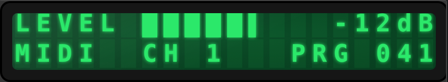
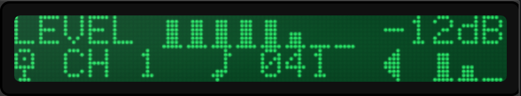
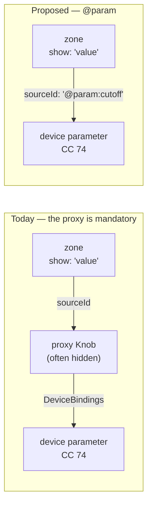
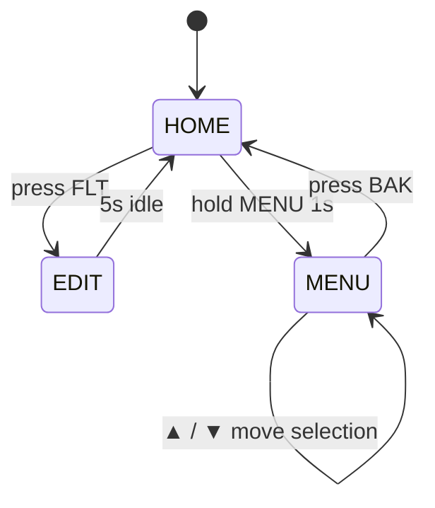
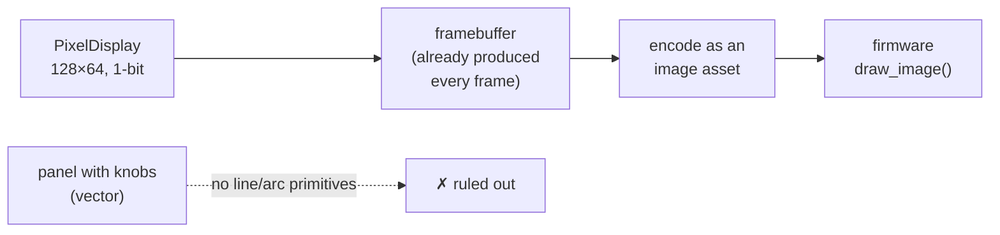

# Display components: what is missing, and what it would take

A design record for `LcdDisplay` and `PixelDisplay`, written after an audit of what the two
components actually do. Nine proposals, in three tiers: things that are simply absent, things that
change what the component *is*, and three that are speculative on purpose.

**This note partly argues with [screen-builder-design.md](screen-builder-design.md).** That document
rules out compiling CEditor panels to the CTRL49's screen, for good reasons. Proposal 7 does not
overturn that; it points at the one component the reasoning does not cover. Read the non-goals
there before reading 7 here.

---

## How to read the pictures

Two kinds, and they must not be confused:

- **`docs/media/display-*.gif`** are *recordings*. They are the real renderers driven by real
  controls; nothing in them is a feature the components lack. See [the gallery](../display-gallery.md).
- **`docs/media/mockup-*.png`** illustrate *this document*. They are rendered by the same
  machinery (`gen-display-demos.mjs --mockups`, scenes in `displayDemos/mockups.mjs`). Most show
  things that do not exist. The soft-key pair is the exception: proposal 4 has since shipped, so
  those two now document a feature — except for the pressed-state highlight, which is still
  hand-drawn because the renderer does not draw one.

Most of the mockups below draw with today's renderer, because in most cases what is missing is
**behaviour, not pixels** — a zone that can be pressed looks exactly like a zone that cannot. Where
a mockup shows something genuinely un-renderable, it says which renderer is standing in.

## The audit, in numbers

Facts this note rests on, all checked on 2026-09-12 rather than assumed:

| Fact | Value |
| --- | --- |
| `LcdDisplay` sections | `Background, Display, Effects, DeviceBindings, Scripts` |
| `PixelDisplay` sections | `Background, Pixel, Effects, DeviceBindings, Scripts` |
| Device-binding ports, both | `text`, `value`, `brightness`, `backlight` |
| `exportValues`, both | `[]` — neither is host-automatable |
| Zone `show` kinds | 16 |
| `lcd.*` script verbs | 35 |
| `pixel.*` script verbs | 19, **not one of which writes content** |
| Hits for CGRAM / custom characters | 0 |

The two verb counts are the whole flattened surface — the hand-written declarations, the
`showGlass`/`showGhost`/`showScanlines`/`showGrid` chrome appended to every family, and the
`read`/`size`/`fill` kinds each family gets for free. (An earlier draft of this note said 28 and 14,
which counted only the hand-written `v(...)` lines. The corrected figures do not change the
finding: the full `pixel` list is `backlight, brightness, contrast, gamma, glow, anim, animPreset,
animSpeed, animLoop, animFps, layoutTransition, transitionMs, brightnessSource, backlightSource,
showGlass, showGhost, showScanlines, showGrid, read` — every one of them chrome.)

Two of those rows are the whole of Tier 1. Neither component has a `Mouse`, `Behavior` or
`HitZones` section — that was the whole of proposal 4, and it is **still true after that proposal
shipped**: pressable zones were built as an exception on the existing click path rather than by
giving a display an interaction model of its own.

---

# Tier 1 — gaps, not decisions

These three are asymmetries. Nothing was decided against; they were not reached.

## 1. User-definable glyphs on the character LCD

**What is missing.** Zero hits for CGRAM, custom characters or user glyphs anywhere in the tree.
Every real HD44780 has eight programmable 5×8 characters, and `PixelDisplay` already has *two*
mechanisms for arbitrary artwork — `bitmap` elements with a `bits` string, and a `customFont`
sprite sheet. The character LCD has neither.

**Why it bites.** `resolveZoneContent`'s `bar` kind builds its bargraph from `█` plus the seven
partial-block characters `▏▎▍▌▋▊▉`. That is a clever fallback and it has two costs: the bar's
appearance depends on the *system font* carrying those glyphs, and no block character has a foot,
so a bar can never have the baseline that real panel bargraphs use to stay readable at a glance.

Today, and the same screen with eight user glyphs (the second is a `PixelDisplay` at the 6×8
character pitch, standing in because the character LCD is precisely the renderer that cannot do it):





The difference is not decoration. The bar gains a continuous baseline and per-segment gaps, so
its length reads without counting; and `MIDI`/`PRG` stop spending eleven of twenty columns on
words a symbol says in one.

**API sketch.** Eight slots in the `Display` section, authored the way a datasheet writes them:

```js
Display: {
  glyphs: [
    { id: 0, bits: '.....|.###.|.###.|.###.|.###.|.###.|.###.|#####' },  // bar, full
    { id: 1, bits: '.....|.....|.....|.....|.###.|.###.|.###.|#####' },  // bar, half
  ],
}
```

Reachable from a zone as `\x00`–`\x07` in `static` text (which is literally how the hardware does
it), and used automatically by `bar` when a full/partial set is defined.

**Cost.** Small and contained. The renderer already has a per-cell glyph pipeline — segment mode
swaps in an SVG per cell, so the seam for "render this cell from a bitmap instead of a font glyph"
exists. The work is the inspector editor (an 5×8 checkbox grid), serialization, and making `bar`
prefer glyphs when present.

**Verdict: do it.** Cheapest item on the list and the most authentic.

## 2. `PixelDisplay` cannot be scripted, only decorated

**What is missing.** Every one of the `pixel.*` verbs is chrome — see the full list in the audit
above. Not one writes an element. The LCD at least has `lcd.text(row, line)` and `lcd.clear()`.

The richest display in the product — the one with `wave`, `adsr`, `scope` and free pixel placement
— is the one a script cannot write a word to. Its `elements` array is editable only in the
inspector.

**This one was attempted, and the attempt found the real problem.** It is written up here rather
than smoothed over, because the finding is the useful part.

The obvious mechanism is the `item` verb kind — "one property of one element of an array field,
addressed 1-based" — exactly how `DrumPads` addresses a pad:

```js
v('text', 'elements', ITEM, { item: 'text', kind: STR }),   // pixel.text(C, 1, 'SATURN VB')
v('show', 'elements', ITEM, { item: 'visible', kind: BOOL }),
```

Four verbs on that pattern were written, and `componentVerbs.test.js` rejected all four:

```
verbs that did nothing:
  pixelText: no patch     pixelShow: no patch
  pixelX: no patch        pixelY: no patch
```

**Why.** Every other `item` list in the spec has a **non-empty default** — six orbit nodes are six
stored objects, so element 1 is always there to be written. `Pixel.elements` defaults to `[]`,
because a pixel display starts blank by design. An index-addressed verb is therefore a silent no-op
on every display whose elements have not already been added in the inspector. That is precisely the
failure the test named *"every verb either changes something or explains why it cannot"* exists to
catch, and there is no exemption list to add to — the assertion is absolute.

There were three bad ways out and all were rejected: seeding `SECTION_DEFAULTS.Pixel.elements`
(changes what a new display *is*), declaring a `count` resolver like `DrumPads` (a pad grid has an
implied size; a blank screen has none), and weakening the test.

**So the real decision is addressing, and it was hiding behind the API sketch.** Index is the wrong
key for this list:

| | Index (`item`, today's mechanism) | Id |
| --- | --- | --- |
| Blank display | Silent no-op | Same, but honestly — the id is absent |
| Reorder in inspector | **Scripts silently retarget** | Stable |
| Cost | One line per verb | A new reducer kind |

Element ids already exist and are stable. `LINK` is precedent for a verb kind that resolves a
*name* in the runtime rather than the reducer, so an id-addressed kind has somewhere to live.

**Cost.** Higher than it first looked: a reducer kind, not a one-liner. Still low risk —
`updateControlProperty` already writes into `Pixel.elements`, which is what the design-mode drag
handles do when an element is moved.

**Verdict: do it, by id.** Still a hole rather than a boundary — but the shape of the fix is now
known rather than assumed.

## 3. `editText` is invisible to everything except the keyboard — **shipped**

`@edit` is a real interactive feature: a focusable field with a caret, keyboard entry, and a
knob that cycles the character under it. And:

- no verb reads or writes `editText`, on either component;
- `exportValues: []`, so a DAW cannot see it;
- the only inbound route is the `text` device-binding port, which overwrites rather than edits.

A patch name is the one genuinely *editable* value a display owns. It should be readable by a
script, bindable both ways, and arguably automatable.

**The verb half is done.** `lcd.editText` and `pixel.editText` now exist — one line each in
`componentVerbs.js`, one verb per family, reading back as well as writing because `read` is one of
the five kinds every family gets for free:

```js
ce.components.lcd.editText(C, 'HYPERSAW BRASS');   // write
const name = ce.components.lcd.editText(C);        // read
```

Adding them required regenerating the three C++ engine preludes
(`gen-script-modules.mjs --write`) and the scripting manual (`npm run docs:manual`) — the parity
tests fail until every runtime agrees a verb exists, which is the mechanism working as designed.

**What is still open** is the host-automation half. `exportValues: []` says an output has nothing to
automate; that ruling was written before `@edit` existed and deserves re-arguing on its own terms,
because a patch name is a value a DAW might reasonably want to see. Not decided here.

---

# Tier 2 — these change what the component is

## 4. Soft keys: zones as hit targets — **shipped**

**The decision was made: yes, as an exception to the rule.** A display stays display-only; only a
zone that *declares* a `press` action takes a click. The general pointer-transparency rule in
`displayMode.js` is untouched.

**What is missing.** `LcdDisplay`'s sections are `Background, Display, Effects, DeviceBindings,
Scripts`. There is no `Mouse`, no `Behavior`, no `HitZones`. The component has **no interaction
model at all** — the text-edit affordance is hard-coded into `PanelPreviewSurface` as a bespoke
`lcdEdit` state machine, not built on any general mechanism.

Every hardware synth screen has F1–F6 underneath it. Both of these render *today*:


The row is four `static` zones, five columns each. The only thing separating the two pictures is
that the second one is a lie: nothing can press a zone.

**What shipped.** A zone gains a `press`:

```js
{ id: 'k2', show: 'static', text: '[FLT]', row: 4, colStart: 6, colEnd: 10,
  press: { layout: 'edit-filter' } }          // or { set: 'cutoff', to: 64 }
```

Two actions, both things a performer does mid-song rather than things an author does once —
the same line `componentVerbs.js` draws for script verbs. `{ script: ... }` was sketched and left
out: firing a hook from a press is a bigger question about who owns the event.

**It turned out cheaper than estimated, because the exception already existed.** An `edit` zone has
been clickable since the edit field was added — `PanelPreviewSurface`'s pointer-down handler
already resolved a clicked cell and armed an edit target. Pressable zones extend that path instead
of opening a new one, so no display acquired a `Mouse` or `HitZones` section and
`displayMode.js` was not touched at all.

**Three decisions worth recording:**

- **A press resolves before an edit.** A zone that declares an action is the more specific intent:
  an edit field is armed by clicking "somewhere on the display" and falls back to its *first*
  target when the click misses, so resolving edits first would make a soft key beside an edit field
  unreachable.
- **A press is resolved in paint order, read backwards.** Zones overlap by design, so the zone a
  user can *see* at a cell is the last one to paint there. `pressTargetAt` walks
  `composeLayout`'s ordering in reverse. An inert zone on top **blocks** a pressable one beneath
  it, for the same reason it hides it: the user pressed what they could see, and what they could
  see does nothing.
- **The navigated layout is transient**, held beside `lcdEdit` rather than written to the panel
  document. It beats the selector and the design default — navigating by hand is the most recent
  thing the user said — but not an overlay, which is a transient interruption that should be seen
  over whatever page you had navigated to.

**Still missing, and worth knowing:** there is **no pressed-state rendering**. Nothing inverts
under the finger, so the "FLT pressed" picture above is hand-drawn by swapping the label's text.
And `PixelDisplay` elements are not pressable — this is `LcdDisplay` zones only.

## 5. Let a zone bind a device parameter directly

**What is missing.** A zone's `sourceId` is always a *control* id. The only exceptions are the two
reserved sources, `@active` and `@edit`. To show a device parameter you must create a control, bind
it to the parameter, and point the zone at the control:



For a screen that reports eight parameters, that is eight controls existing only to be read.

**The plumbing half-exists.** The `address` show kind already reaches *through* a control into its
`DeviceBindings` to print the CC/NRPN address — so the zone engine has already been taught that a
device parameter is a thing a zone can talk about. `@param:<id>` extends the reserved-source
mechanism that `@active` and `@edit` established.

**Cost.** Moderate. `collectSourceIds` and the preview's `__live` builder both need to resolve a
parameter id against the profile rather than the control list; the profile already exposes
parameters by id for the binding UI.

**Verdict: worth doing, after 4.** It removes a real modelling wart.

## 6. Layouts as a state machine, not a lookup

**What exists.** `pages.selectorMap` maps a control's value to a layout, plus `overlays` that show
a layout transiently on a trigger. Both are *stateless*: the active layout is a pure function of
the current values.

Real device menus are not. Three screens, each of which renders today:


What cannot be expressed is the *edges* between them:



"Press FLT" is not a value change. "5 s idle" is not a value at all. And `MENU → MENU` carries
state — *which* item is selected — that no layout can hold, because a layout is a list of zones,
not a record.

**API sketch.** `pages` gains transitions alongside the selector map, and the display gains a small
amount of its own state:

```js
pages: {
  defaultLayoutId: 'home',
  transitions: [
    { from: 'home', on: { press: 'k2' }, to: 'edit-filter' },
    { from: 'edit-filter', on: { idle: 5000 }, to: 'home' },
  ],
  state: { cursor: 0 },     // readable by a zone as '@state:cursor'
}
```

**Cost.** Higher, and it depends on 4 — `on: { press }` needs pressable zones to exist first.
`resolveActiveLayoutId` becomes stateful, which means the preview has to own that state and reset
it sensibly. Sequence this after soft keys or not at all.

---

# Tier 3 — speculative on purpose

## 7. A `PixelDisplay` on the CTRL49's real screen

**Read the non-goal first.** `screen-builder-design.md` rules this out for panels, and the reason
is sound: the firmware's Lua environment has 16 device functions — rectangles, text, and pre-made
images — with no line or arc primitives, proven by live enumeration. Translating the panel editor's
visual language into that would be "enormous effort for a degraded imitation".

**The seam.** That reasoning is about *vector* content. A `PixelDisplay` is not vector content —
it is a 1-bit framebuffer, and "pre-made image" is one of the sixteen things the firmware *can*
draw. It is the one component in the product whose output is already in the hardware's vocabulary.



**What would have to be proven, in this order:**

1. **Bandwidth.** The design note's filmstrip approach implies pre-rendered assets are uploaded
   ahead of time, not streamed. If a 128×64 1-bit frame (1 KB raw) cannot be pushed at even 5 fps,
   this is a static-screen feature, not a live one — still useful, much less exciting.
2. **Image format.** Whether `draw_image` accepts an arbitrary uploaded buffer or only assets
   registered in the bundle.
3. **Who owns the screen.** The broker model says exactly one process owns the CTRL49. A panel's
   display would have to be a *client* of the bridge, like everything else.

**Verdict: a one-day spike, not a roadmap item.** Answer (1) first; if the answer is "static only",
write that down next to the non-goal and stop.

## 8. A scope fed by real audio

`wave`, `scope` and `adsr` synthesize their pictures from MIDI values — 16 additive harmonics
rolled off by whatever the `cutoff` link reads. That is genuinely clever and it is why they work
with no audio path at all.

But the product *does* have audio: an out-of-process plug-in worker and a child-process auditioner
that has been measured against a 3,600-program Surge XT library. A `scope` element whose source is
the loaded instrument's actual output would turn a decorative graph into a real meter.

**The hard part is not the drawing** — the scope already keeps a rolling history and renders it.
It is getting audio across a process boundary at a useful rate without compromising the isolation
that `hostProductBuild.test.js` exists to protect. A lock-free ring of peak values (not samples) at
~50 Hz would be enough to draw a level scope and is cheap to ship over the existing channel.

**Verdict: valuable, and it belongs to the host work, not the display work.** The display end is a
new `source: 'audio'` on an element that already exists.

## 9. Mirror the device's own screen

Some synths transmit their LCD contents over SysEx; for others the screen is derivable from
parameter state the profile already models. A `show: 'deviceScreen'` zone would put the hardware's
own display inside the editor — the most direct possible answer to "is the editor in sync with the
box?".

**Why it is last.** It is per-device work with no shared payoff: a dump format that one profile
understands buys nothing for the next. It would be a spectacular demo for one flagship device and
dead weight everywhere else.

**Verdict: only if a specific device's users ask.** Worth recording as a possibility so nobody
re-derives it.

---

## Ranking

| # | Proposal | Effort | Changes the model? | Do it? |
| --- | --- | --- | --- | --- |
| 4 | Soft keys | Moderate | No, as it turned out — an exception, not a model | **Shipped** |
| 3 | `editText` verbs | Very low | Partly (automation) | **Shipped** |
| 1 | User glyphs | Small | No | **Next** |
| 2 | Pixel content verbs | Low → moderate (id addressing) | No | Yes |
| 5 | `@param` zones | Moderate | Yes — removes the proxy | Yes |
| 6 | Layout state machine | High | Yes — layouts gain state | Now unblocked |
| 7 | CTRL49 framebuffer | Spike | n/a | Spike only |
| 8 | Real-audio scope | High | No (host work) | Later |
| 9 | Device screen mirror | Per-device | No | On request |

**Soft keys are done.** They changed the component's category — a display is now a UI surface —
without changing its model, because the click path was already there for edit fields.

**If one cheap: user glyphs.** The renderer already has a per-cell glyph pipeline to hang them on.

---

## Status and sequence

| # | State |
| --- | --- |
| 4 | **Shipped** — pressable zones, `{ layout }` and `{ set }`. No pressed-state rendering; LcdDisplay only. |
| 3 | **Shipped** — `lcd.editText` / `pixel.editText`. Host automation still open. |
| 2 | **Attempted; redesigned.** Index addressing rejected by the spec test; needs an id-addressed reducer kind. |
| 1, 5, 6 | Not started. |
| 7, 8, 9 | Spike / later / on request. |

### The next three steps, in order

**Step 1 — user glyphs (proposal 1).** Unblocked, self-contained, and no decision is waiting on
anyone. Sequenced first *because* it is independent: it touches `sectionDefaults`, the renderer's
per-cell path and one inspector editor, and it collides with nothing else on this list. The
acceptance test is that `bar` prefers glyphs when a full/partial set is defined and falls back to
the block characters when it is not.

**Step 2 — settle the soft-key question, then build it (proposal 4).** The code is not the hard
part; this one question is, and it is the owner's to answer:

> When a zone can be pressed, is the display still "display-only"? `interactionPolicy` makes a
> read-only control transparent to the pointer *specifically so* a meter laid over a knob passes
> the click through. Displays do not go through that path today. Do pressable zones become an
> exception to that rule, or does the display acquire a real `Mouse`/`HitZones` section and stop
> being display-only altogether?

The second answer is more work and more honest. Either way, decide before writing code — a
half-answered interaction model is the expensive kind of mistake.

**Step 3 — id-addressed element verbs (proposal 2), then `@param` zones (proposal 5).** Both are
addressing problems and they rhyme: one lets a script name an element, the other lets a zone name a
parameter. Doing them together means designing the reserved-source/id-resolution story once.

Proposal 6 is **no longer parked** — `on: { press }` now has something to hang on, and the
transient per-display layout that soft keys introduced is the state a menu needs. What it still
lacks is the *other* kind of edge: a timeout, which no value change can express.

### What would make this note wrong

Worth writing down so it can be checked rather than trusted: the numbers in the audit table were
counted on 2026-09-12 against `componentVerbs.js`, `componentPorts.js`, `componentTypes.js` and
`lcdZones.js`. If a later reader finds `pixel.*` has content verbs, or a `Mouse` section on a
display, this note has been overtaken and the code is right.

## Deliberately not proposed

- **Colour on the character LCD.** The palette is per-screen for a reason; per-cell colour would
  make it a pixel display with extra steps.
- **A general vector layer.** `PixelDisplay` exists precisely so that free drawing has a home with
  a 1-bit contract. Adding curves to the character grid would blur both.
- **Compiling panels to the CTRL49.** Already ruled out, and 7 does not reopen it.
