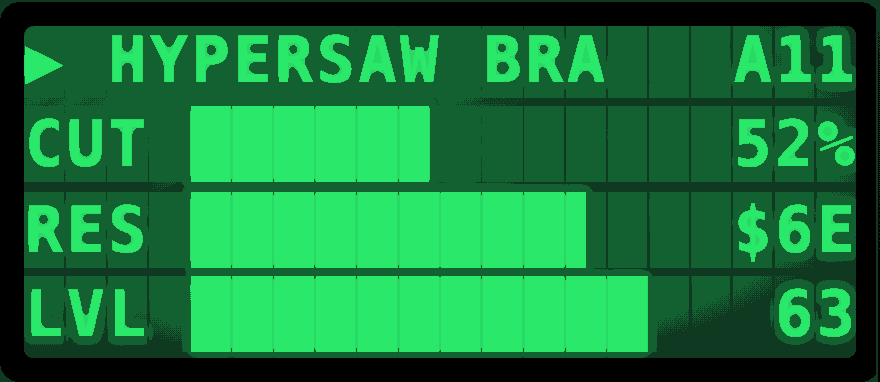
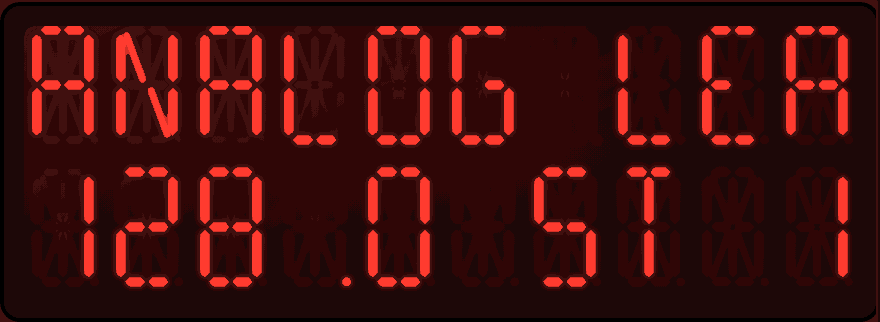
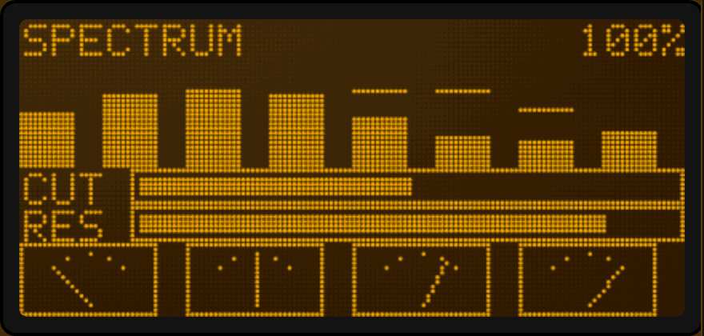
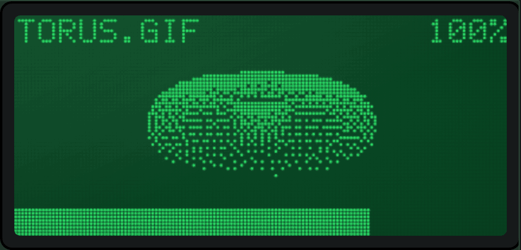
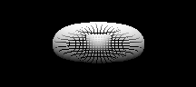
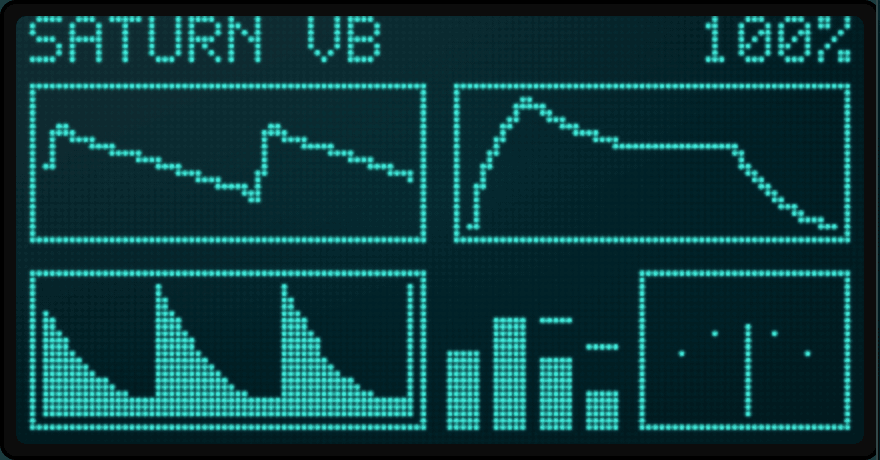

# The display components, filled and moving

Five recordings of the two display components: one per screen technology they implement, plus the
dot-matrix panel playing a GIF loaded into it. Every one is the real renderer driven by real panel
controls through the real preview path — not a mock-up, not a drawing. A component that stops doing
one of these things stops being able to show it here.

Regenerate them with:

```bash
node tools/scripts/gen-display-demos.mjs            # all five → docs/media/display-*.gif
node tools/scripts/gen-display-demos.mjs --only pixel --png   # one, plus frame 0 as a PNG
node tools/scripts/gen-display-demos.mjs --verify   # prove determinism and loop closure

# One self-contained .html with every recording inlined — for sending to someone, or for
# any viewer that shows a GIF as a still first frame.
node tools/scripts/displayDemos/inlineStandalone.mjs page.html out.html
```

The scenes are data in [`tools/scripts/displayDemos/scenes.mjs`](../tools/scripts/displayDemos/scenes.mjs);
the recorder is [`gen-display-demos.mjs`](../tools/scripts/gen-display-demos.mjs). Neither is part
of `npm test`: they need Chromium and a dev server, and a missing picture must not be able to fail
a build that has nothing to do with it.

---

## What a link is, and why these are the point

A display holds no values. Every field on one of these screens is a **link**: a zone (or, on a
PixelDisplay, an element) naming a source control by id and a `show` kind saying how to render that
control's value. The scenes below use ten of those kinds between them, because the interesting
claim is not "the LCD can print text" — it is that the same value reaches a bar, a percentage, a hex
byte and a needle without anything in the display knowing what a filter cutoff is.

The values travel the way they travel in the app: a knob's preview session → `PanelPreviewSurface`'s
`__live` map → the renderer. Nothing is written into the display directly.

---

## 1. Character LCD — 20×4, green STN



An HD44780 as you would actually meet one: one glyph per cell, faint unlit cells behind the text,
and a backlight wash under the glass.

| Zone | Link | `show` | What it renders |
| --- | --- | --- | --- |
| Patch name | a `Label` | `text` | Marquees when it overflows its 12-column region |
| `CUT` | cutoff knob | `bar` | Block-character bargraph with eighth-block partials |
| `52%` | the *same* knob | `pct` | Percentage of the control's own range |
| `RES` | resonance knob | `bar` | |
| `$6E` | the same knob | `midiValue` | The value as a MIDI byte, hex |
| `LVL` | level fader | `bar` | |
| `63` | pan knob | `value` | Raw value, −64…63 |
| `▶`, `A11` | — | `static` | Fixed text; no source at all |

The bar is worth a second look: it is made of `█` and the seven partial blocks, so an eleven-column
bar resolves 88 steps rather than 11.

---

## 2. 16-segment LED — red



The same zone engine, rendered as starburst segments instead of glyphs. Each cell is an SVG of 16
polygons plus a decimal point, with the unlit segments left visible — which is what makes a segment
display read as hardware rather than as a font.

| Zone | Link | `show` |
| --- | --- | --- |
| Patch name | a `Label` | `text`, scrolling |
| `128.0` | tempo knob | `value` at one decimal |
| `ST` | — | `static` |
| step number | step knob | `value`, stepping 1 → 16 |

Note what the segments cannot do, because it is a real limit and not a bug: letters with no
16-segment form fall back to the conventional hardware stand-ins, and block characters are
approximated. A bargraph on a segment panel is a compromise; on the two panels below it is not.

---

## 3. Dot-matrix graphic LCD — 144×64, amber



`panelType: 'graphic'` stops composing characters and starts addressing pixels. Text still lands on
the character grid, but the widget zones become real drawings on a canvas — which is what lets this
panel carry meters that a character LCD can only imitate.

| Widget | Link | Kind | Behaviour |
| --- | --- | --- | --- |
| Eight analyser bars | eight band knobs | `vbar` | Smoothed attack, peak markers that hold ~0.8 s then fall |
| `CUT`, `RES` | cutoff / resonance | `hbar` | Framed, smoothed — they lag the value the way a meter does |
| Four VU needles | pan, cutoff, resonance, level | `needle` | 135°→45° sweep with tick marks |
| `SPECTRUM`, `100%` | level fader | `static`, `pct` | Character zones, on the same grid |

The peak-hold markers are the detail that repays watching: they are the floating dashes above the
bars, and they fall on their own schedule rather than following the bar down.

---

## 3b. The same panel, playing a loaded GIF



The graphic panel does not only draw its own widgets — it will play an animation file behind them.
`animMode: 'file'` hands `animSrc` to `LcdGraphicCanvas`, which fetches it, decodes it frame by
frame through the browser's `ImageDecoder` (up to `MAX_ANIM_FRAMES`, 180), Floyd–Steinberg dithers
each frame to the 1-bit grid, and plays it back at the **file's own per-frame durations** rather
than at a fixed rate. `animFps` is consulted only for sprite sheets.

The source here is 216×96 greyscale, 30 frames, generated by
[`displayDemos/sourceAnimation.mjs`](../tools/scripts/displayDemos/sourceAnimation.mjs):



| Property | Value | What it does |
| --- | --- | --- |
| `animMode` | `'file'` | Play an animation file behind the zones |
| `animSrc` | a data URL | The GIF itself, stored inside the panel document |
| `animLoop` | `true` | Repeat rather than hold the last frame |
| `imageDither` | `true` | Floyd–Steinberg rather than a hard threshold |
| `animFrames` | `0` | An animated file, not a sprite sheet |

Two things this scene exists to show. **A shaded solid is the honest test of the dithering** — hard
edges would prove only that the file decoded, because thresholding them looks identical to
dithering them. And **the animation plays behind the panel's own live fields**: `TORUS.GIF`, the
percentage and the level bar are ordinary linked zones composited over the picture, not baked into
it.

The source loops in 1500 ms, exactly half the 3 s capture, so the panel plays it twice and the
recording still wraps seamlessly.

A GIF is stored as a data URL because that is what the app itself does with an animation uploaded
in the inspector — the panel stays one self-contained document. The demo therefore exercises the
same path a user's own upload takes.

---

## 4. Free-pixel OLED/VFD — 128×64



A `PixelDisplay`: no character grid at all, elements placed at `(x, y, w, h)` on the pixel grid, and
three graph kinds that exist only here.

| Element | Link | Kind | What it draws |
| --- | --- | --- | --- |
| Oscillator | level, cutoff, resonance, sweep | `wave` | 16 additive harmonics, rolled off by the cutoff link, with a resonance bump near it — a *synthesized* picture of the sound, from MIDI values, with no audio anywhere |
| Envelope | four A/D/S/R knobs | `adsr` | The curve those four values describe |
| Scope | level fader | `scope` | A filled rolling history — the three struck notes per loop are the three decays |
| Meter bank | four band knobs | `vbar` | Peak-holding, as above |
| Needle | pan knob | `needle` | |
| `SATURN VB`, `100%` | level fader | `static`, `pct` | 5×7 pixel font, rasterised onto the grid |

The oscillator drawing deserves the emphasis. It is not a recording and not a stock waveform: the
harmonic gains are computed per frame from whatever the cutoff and resonance links currently read,
so opening the filter visibly adds harmonics to the trace.

---

## Two things these recordings are not

**They are not a Windows run.** Everything above renders identically off Windows — that is how these
were recorded — but the `#if JUCE_WINDOWS` branches of the C++ side are not exercised by a picture
of the web layer. See [wine-compile.md](wine-compile.md) for what does and does not carry over.

**The motion is scripted, not sampled.** The source controls are driven by the periodic functions in
`scenes.mjs`, chosen so that every one satisfies `f(0) === f(1)` and the GIF loops without a seam.
Real device feedback arrives through the same `__live` path and looks the same; it simply does not
repeat every three seconds. `--verify` checks the seam by capturing one extra frame and diffing it
against frame 0 — all four currently report 0.00% of pixels differing, and byte-identical replays.
